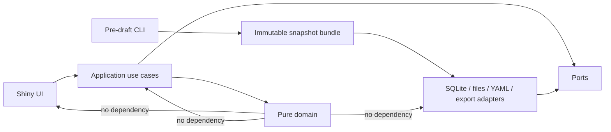
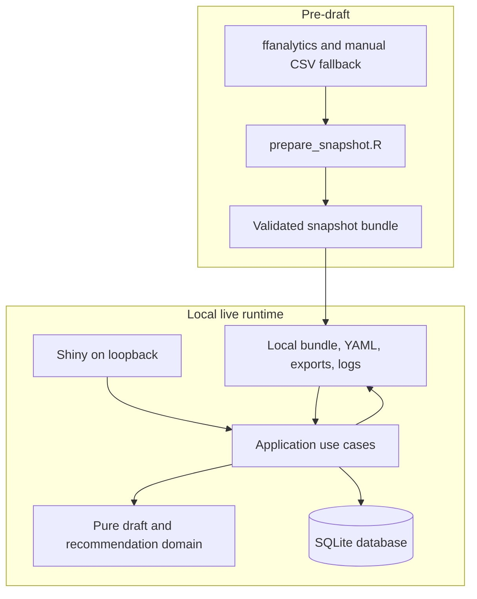
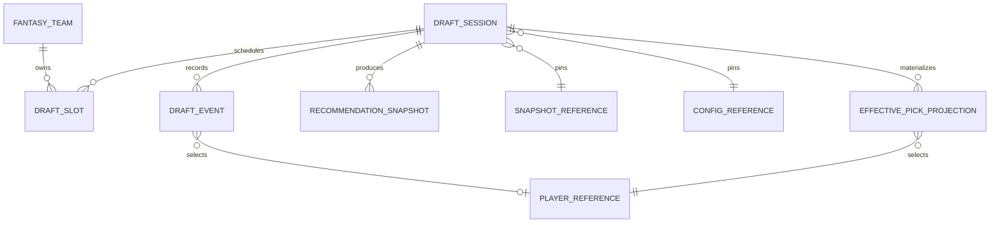

# Architecture Spine — Fantasy Draft War Room

## Design Paradigm

**Hexagonal Architecture — Functional Core, Imperative Shell.** `Shiny` apresenta e coleta intenção; casos de uso orquestram; o domínio calcula e valida sem I/O; adaptadores realizam I/O.



## Invariants & Rules

### AD-1 — Core domain has no framework or I/O dependency `[ASSUMPTION]`

- **Binds:** DRAFT, ORDER, LEAGUE, ROSTER, REC, MAINT-001–004
- **Prevents:** business rules becoming Shiny observers, SQL queries, or filesystem calls with incompatible side effects.
- **Rule:** Domain functions are deterministic, receive every input explicitly, return values or structured domain errors, and never import `shiny`, `DBI`, `RSQLite`, `yaml`, filesystem, clock, or reactive APIs. Application use cases are the sole callers of domain commands and ports.

### AD-2 — Pre-draft pipeline and live runtime are separate trust boundaries `[ADOPTED]`

- **Binds:** DATA-001–005, PERF-005–006, REL-001, REP-002
- **Prevents:** scraping, slow preparation, or a changed data source from affecting a live draft.
- **Rule:** `scripts/prepare_snapshot.R` is the only component allowed to acquire or enrich projection data and may use `ffanalytics`; it emits a validated snapshot bundle. The live application accepts only a local bundle selected before start and performs no network I/O.

### AD-3 — Snapshot bundle is canonical and immutable during a session `[ADOPTED]`

- **Binds:** DATA-002–005, LEAGUE-004, DRAFT-001, REP-002–003
- **Prevents:** two builders interpreting projection files, scoring, or a snapshot identity differently.
- **Rule:** A bundle contains `players.csv`, `metrics.csv`, `metadata.json`, and `qa-report.json`. Its `snapshot_content_hash` is SHA-256 over a canonical manifest: UTF-8 LF-normalized bytes, sorted relative paths, and each file's SHA-256; the manifest excludes the derived hash field in `metadata.json` and includes all other bytes. `metadata.json` carries `snapshot_id`, schema version, season, generation time, source list, pipeline version, scoring config hash, and the manifest hash. Validation completes before session creation. A started session stores `snapshot_id` and `snapshot_content_hash` and cannot replace the bundle.

### AD-4 — Commands append events atomically; state is a deterministic projection `[ADOPTED]`

- **Binds:** DRAFT-002–011, PERSIST-001–004, REL-001–003
- **Prevents:** UI-local state, mutable pick rows, and SQLite state from disagreeing after a correction or refresh.
- **Rule:** `start`, `record_pick`, `undo_last_pick`, `correct_pick`, `pause`, `resume`, `complete`, and `abort` each enter through one application use case. Every event has versioned payload fields `{draft_id, event_sequence, event_type, expected_state_hash, expected_overall_pick, target_overall_pick, player_id, actor, created_at}` as applicable. The reducer validates the command against reconstructed state, appends exactly one ordered immutable event, and replaces the materialized read model in the same SQLite transaction. `record_pick` at the final slot transitions to `COMPLETED` in the resulting projection; administrative abort is the only other terminal command. Failed or stale validation commits nothing.

### AD-5 — Corrections preserve history and later picks `[ADOPTED]`

- **Binds:** DRAFT-006–007, PERSIST-002–004, AC-V1-04
- **Prevents:** destructive rewriting of audit history or silently discarding valid later picks.
- **Rule:** Undo is an event that removes the latest effective pick in replay. Correction is an event naming its target `overall_pick` and replacement `player_id`; replay applies the correction in sequence. If replay would duplicate a player, violate a slot, or otherwise invalidate any effective pick, the correction is rejected and no event is appended.

### AD-6 — Session provenance is frozen and addressable `[ADOPTED]`

- **Binds:** LEAGUE-004, REC-001–010, PERSIST-005–007, EXPL, REP
- **Prevents:** exports and recommendations that cannot be reproduced or attributed to their inputs.
- **Rule:** At `DRAFT_STARTED`, persist snapshot ID/content hash, canonical `scoring_config_hash`, `league_rules_hash`, `recommendation_policy_hash`, their schema versions, engine version, and optional random seed. YAML defaults are resolved and types coerced before canonical serialization and hashing. Snapshot selection requires matching `scoring_config_hash`; league rules and policy are session inputs. Every recommendation and export carries this provenance plus the resulting state hash; none of these inputs may mutate in place.

### AD-7 — Configuration is validated data, not executable behavior `[ASSUMPTION]`

- **Binds:** LEAGUE-001–004, LEAGUE-007, REC-009, MAINT-004
- **Prevents:** hard-coded league rules or arbitrary logic loaded from configuration files.
- **Rule:** League, scoring, tier, and recommendation-policy files are versioned YAML schemas parsed into canonical configuration objects. The configuration validator enforces the V1 envelope before a draft can start; only declared scalar values, lists, and maps are accepted. The canonical serialization is what is hashed and stored.

### AD-8 — SQLite is the single local system of record `[ASSUMPTION]`

- **Binds:** PERSIST, REL, DRAFT, PERF-001, UX-001
- **Prevents:** separate per-browser stores, concurrent writers, or filesystem exports becoming authoritative state.
- **Rule:** V1 runs as a single-user local Shiny process. SQLite holds sessions, slots, immutable events, an `effective_pick_projection`, materialized state, and migration history. The event log is append-only and has no uniqueness constraint on player history. A database transaction enforces monotonic `event_sequence`, unique `(draft_id, overall_pick)` in `effective_pick_projection`, unique `(draft_id, player_id)` there, and one projection sequence/state cursor per draft; event, effective picks, derived state, cursor, and hashes are replaced together. Exports are derived artifacts.

### AD-9 — V1 recommendation is synchronous, fast, and explainable `[ADOPTED]`

- **Binds:** REC-001–010, PERF-002–004, EXPL-001–004, REP-002
- **Prevents:** a recommendation depending on network, unbounded simulation, stale asynchronous results, or opaque scoring.
- **Rule:** `recommend_fast()` is a pure domain function over frozen draft state, prepared player metrics, league configuration, and policy. The live read path uses in-memory snapshot metrics and indexed available-player lookup; no scraping, SQL scan, or deep simulation is on the critical path. It returns ordered candidates with component scores, at least three applicable structured factors, reason codes, deterministic text, warnings, state hash, and engine version. V1 uses prepared VOR/tier/ADP and marginal roster value only; market forecasting and simulation do not execute on the live path. The benchmark gate is p95 ≤100 ms for pick persistence/search, ≤300 ms for recommendation, ≤500 ms for screen update, and ≤3 s startup using the 400-player, 12-team fixture.

### AD-10 — Live process is local-only and observable `[ASSUMPTION]`

- **Binds:** PERF-006, REL, UX, operational envelope
- **Prevents:** an accidental public or multi-tenant service surface and failures that are invisible during the draft.
- **Rule:** The V1 app is launched by `Rscript -e "shiny::runApp(...)"` (or the equivalent package entry point), binds to loopback, and hands its URL to the user's browser. It detects a port collision and fails with an actionable message rather than binding publicly. Database, logs, and exports reside in an OS user-data directory outside the source tree with user-only permissions where supported. Adapters emit structured local logs and command/recommendation latency metrics without recording projection source credentials. Startup checks schema migrations, writable storage, and selected bundle validation before enabling a session.

### AD-11 — Recovery selection is explicit and stale intents are rejected `[ADOPTED]`

- **Binds:** DRAFT-009, REL-001–002, UX-001–004
- **Prevents:** restoring an unintended session or applying a keyboard action to a state that changed after the screen rendered.
- **Rule:** An application query lists local sessions by `updated_at DESC` and preselects the newest, but restoration occurs only after an explicit user confirmation or selection. The selected `draft_id` is the sole restore input. Every mutating UI intent carries `expected_state_hash` and (for picks) `expected_overall_pick`; the use case rejects stale intents with a structured error and reload instruction.

### AD-12 — Canonical state and event replay have one byte-level contract `[ASSUMPTION]`

- **Binds:** AD-4, AD-5, AD-6, AD-8, AD-9, REP-002–003
- **Prevents:** two reducers, exporters, or recommendation caches producing different hashes for the same draft.
- **Rule:** `draft_state_hash = SHA-256(canonical_json_v1(state_subset))`, where the subset is `{draft_id, status, current_overall_pick, effective_picks sorted by overall_pick, rosters sorted by team_id/player_id, remaining_slots sorted by team_id/slot, pinned provenance}`. Canonical JSON uses UTF-8, LF, sorted object keys, fixed decimal representation, explicit `null` for missing values, and excludes timestamps, latency, and UI-only fields. Every event stores both `previous_state_hash` and `resulting_state_hash`; replay verifies both before materializing.

## Consistency Conventions

| Concern | Convention |
| --- | --- |
| R names | `snake_case`; pure domain functions are verbs (`record_pick`); domain values and columns are `snake_case`. |
| Identifiers | Immutable text IDs: `snapshot_id`, `player_id`, `draft_id`, `event_id`, `fantasy_team_id`; hashes are lowercase SHA-256 hex. |
| Time and ordering | UTC ISO-8601 timestamps; `event_sequence` is the authoritative order, never timestamp order. `overall_pick` is unique only in the effective projection. |
| Canonicalization | Snapshot manifests and state hashes use UTF-8, LF, sorted keys/paths, explicit nulls, and fixed numeric formatting as specified by AD-3/AD-12. |
| Events and errors | Event types are UPPER_SNAKE_CASE. Domain failures use a stable `code`, human-safe Portuguese message, and machine-readable details. |
| State mutation | UI emits intents only; application use cases own transactions; domain owns validation; adapters own I/O. |
| Configuration | Source YAML is versioned; canonical parsed form is hashed; no live session reads mutable configuration. |
| Testing | Unit-test domain functions outside Shiny/SQLite. Test use cases against a temporary SQLite database; acceptance fixtures use the V1 12-team benchmark. |

## Stack

| Name | Version |
| --- | --- |
| R | 4.6.0 |
| Shiny | 1.14.0 |
| DBI | 1.3.0 |
| RSQLite / SQLite | 3.53.3 |
| renv | version locked in `renv.lock` |
| ffanalytics (pre-draft only) | 3.x, Git commit `1955daa05efb4a1f38c9a4dee609c5c4eaf84b4d` |

All transitive package versions are locked in `renv.lock`; package resolution is a build-time concern, never a live-draft concern.

## Structural Seed





```text
FantasyDraftWarRoom/
  DESCRIPTION                 # R package dependency contract
  renv.lock                   # exact dependency and remote revisions
  app.R                       # local Shiny composition root only
  R/
    domain_*.R                # pure league, schedule, state, roster, recommendation rules
    application_*.R           # command/query use cases and port contracts
    adapter_sqlite_*.R        # event store, read model, migrations
    adapter_files_*.R         # snapshot, YAML, export, log adapters
    ui_*.R                    # Shiny modules and presenters
  scripts/
    prepare_snapshot.R        # pre-draft CLI entry point
  config/                     # versioned YAML defaults and schemas
  inst/schema/                # SQLite migrations and snapshot schema
  tests/                      # unit, integration, recovery, benchmark fixtures
```

## Capability → Architecture Map

| Capability / Area | Lives in | Governed by |
| --- | --- | --- |
| Snapshot generation and quality | `scripts/`, file adapter | AD-2, AD-3 |
| League, schedule, slots, roster | domain | AD-1, AD-7 |
| Pick, undo, correction, lifecycle | application + SQLite adapter | AD-4, AD-5, AD-8 |
| Search and keyboard flow | Shiny UI + application queries | AD-1, conventions |
| Fast recommendation and explanation | domain + Shiny presenter | AD-1, AD-6, AD-9 |
| Recovery, session selection, export | application + SQLite/file adapters | AD-4, AD-6, AD-8 |
| Performance, local operation, logs | composition root + adapters | AD-2, AD-10 |

## Deferred

- **V2 market-aware engine:** probability of availability, VONA, positional runs, historical recommendations, and candidate comparison wait for a validated market model; they must enter as pure domain inputs and never weaken AD-9.
- **V3 simulation engine:** Monte Carlo, asynchronous jobs, mock drafts, and backtesting wait until their result-versioning and stale-result contract is specified; they remain outside command handling.
- **Portable session re-import:** V1 exports audit-ready artifacts but does not promise package re-import. Define an import/migration and trust contract before adding it.
- **Distribution and updates:** installer, code-signing, auto-update, and hosted deployment are out of V1. Any future hosted mode must replace AD-10 with explicit tenancy, authentication, secret, and concurrency decisions.
- **Projection-provider resilience:** provider selection, source credentials, and source-level retries belong to the pre-draft pipeline contract; V1 runtime stays insulated by AD-2.
