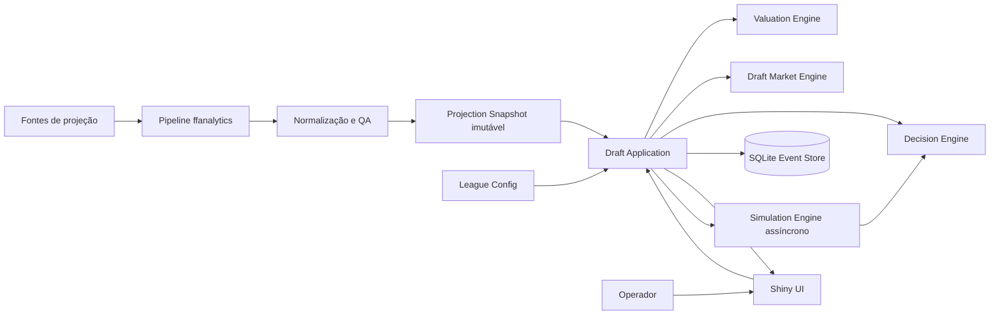
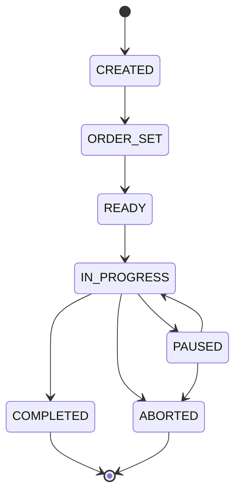

# Fantasy Draft War Room
## Especificação de Produto, Arquitetura e Roadmap de Implementação

**Versão do documento:** 0.1  
**Data:** 28 de agosto de 2026  
**Status:** Proposta para implementação  
**Tecnologia-alvo:** R, Shiny, SQLite e processamento pré-draft com `ffanalytics`  
**Agentes de desenvolvimento:** Codex ou Claude Code  
**Nome provisório do pacote:** `ffwarroom`

---

## 1. Resumo executivo

O **Fantasy Draft War Room** é uma aplicação Shiny para apoiar, em tempo real, um draft snake de NFL Fantasy. O sistema recebe previamente projeções consolidadas de jogadores, configura a liga e a ordem do draft, registra cada escolha e recomenda as melhores decisões para o time do usuário.

A aplicação deve ser operacionalmente segura sob uma restrição essencial: o draft é rápido e não pode ficar esperando scraping, grandes recomputações ou simulações extensas. Por isso, a solução será dividida em dois contextos:

1. **Pré-draft**, onde ocorrem scraping, consolidação de projeções, cálculo de métricas, preparação de tiers e pré-computações.
2. **Live draft**, onde o sistema apenas atualiza estado, consulta estruturas já preparadas, executa cálculos marginais e apresenta recomendações quase instantâneas.

A arquitetura será organizada em três motores analíticos:

- **Valuation Engine:** determina o valor intrínseco dos jogadores para a liga.
- **Draft Market Engine:** estima disponibilidade futura, custo de oportunidade e comportamento da mesa.
- **Decision Engine:** combina valor, mercado, composição do roster e estratégia para recomendar a próxima escolha.

Uma quarta capacidade, o **Simulation Engine**, será introduzida na terceira versão e funcionará fora do caminho crítico da interface.

O produto será desenvolvido em três versões incrementais:

- **Versão 1 — Operational MVP:** draft completo, persistente, recuperável e recomendações rápidas baseadas em projeções, VOR, tiers, ADP e necessidade marginal.
- **Versão 2 — Market-Aware Intelligence:** probabilidade de disponibilidade no próximo pick, VONA, tier cliffs, melhor avaliação de roster e explicações estruturadas.
- **Versão 3 — Adaptive Simulation Lab:** Monte Carlo assíncrono, aprendizado do comportamento da mesa, mock drafts, backtesting e comparação de estratégias.

---

## 2. Visão do produto

### 2.1 Problema

Cheat sheets tradicionais apresentam um ranking estático. Elas não respondem adequadamente às perguntas que surgem durante um snake draft:

- O jogador mais valioso agora ainda estará disponível no próximo pick?
- Qual posição sofrerá a maior queda de valor até a próxima escolha?
- Um jogador melhora o lineup titular ou apenas ocupa o banco?
- A sequência real da mesa está antecipando RBs, WRs, QBs ou TEs?
- O usuário deve entrar em uma corrida por posição ou explorar os valores deixados pelos adversários?
- A escolha atual melhora o roster final esperado, e não apenas o total bruto de pontos projetados?

O War Room transforma projeções em uma decisão contextual.

### 2.2 Proposta de valor

A cada pick, o sistema deve responder:

> Dado o estado atual do draft, meu roster, minha próxima escolha e os jogadores disponíveis, quais são as melhores decisões agora, qual é a urgência de cada uma e por quê?

### 2.3 Usuário principal

Um fantasy manager operando o aplicativo em notebook ou desktop enquanto acompanha um draft realizado em outra plataforma ou presencialmente.

### 2.4 Princípios de produto

1. **Resposta imediata:** a recomendação rápida nunca depende de scraping ou Monte Carlo.
2. **Operação offline durante o draft:** o sistema deve funcionar sem rede depois que o snapshot for preparado.
3. **Explicabilidade:** toda recomendação deve apresentar fatores objetivos.
4. **Controle humano:** o usuário pode discordar, escolher outro jogador e continuar normalmente.
5. **Recuperabilidade:** fechar ou recarregar o navegador não pode destruir o draft.
6. **Configuração, não hardcode:** posições, número de times, rounds, flex e scoring devem ser configuráveis.
7. **Núcleo independente de Shiny:** regras e algoritmos devem ser funções testáveis fora da interface.
8. **Evolução incremental:** nenhuma funcionalidade avançada pode comprometer a operação básica.
9. **Reprodutibilidade:** projeções, configurações, pesos e seeds devem ficar registrados.
10. **Snapshot imutável:** o estado analítico usado em um draft não deve mudar silenciosamente no meio da sessão.

---

## 3. Escopo inicial e premissas

### 3.1 Configuração-base da liga

A primeira configuração validada será:

- 12 times;
- draft snake;
- 14 rounds;
- Full PPR;
- sem cap e sem leilão;
- 1 QB;
- 2 RB;
- 2 WR;
- 1 TE;
- 1 FLEX elegível a RB ou WR;
- 1 K;
- 1 DST;
- 5 reservas.

A arquitetura deverá aceitar outras quantidades sem reescrita do núcleo.

### 3.2 Dentro do escopo

- Construção e validação de snapshot de projeções.
- Configuração da liga e dos slots.
- Cadastro dos fantasy teams.
- Definição da ordem da primeira rodada.
- Geração automática do draft snake.
- Início, pausa, retomada e encerramento do draft.
- Entrada manual de picks.
- Busca rápida de jogadores.
- Correção e desfazimento de picks.
- Construção dos rosters.
- Recomendação contextual.
- Alertas de tier cliff.
- Persistência local.
- Exportação do resultado.
- Mock draft e simulação nas versões avançadas.

### 3.3 Fora do escopo inicial

- Integração automática com ESPN, Yahoo, NFL, CBS, Sleeper ou outra plataforma de liga.
- Draft de leilão.
- Dynasty ou keeper.
- Rookie-only draft.
- Waivers e gestão semanal.
- Trade analyzer.
- Projeção de playoffs da liga.
- Multiusuário simultâneo.
- Aplicativo móvel nativo.
- Hospedagem pública multi-tenant.
- Recomendações baseadas em notícias em tempo real durante o draft.

Esses itens podem ser tratados posteriormente como extensões.

---

## 4. Requisitos funcionais

### 4.1 Gestão do snapshot de dados

**FR-DATA-001 — Importar projeções**  
O sistema deverá aceitar um snapshot padronizado gerado pelo pipeline pré-draft.

**FR-DATA-002 — Registrar metadados**  
Cada snapshot deverá registrar temporada, data e hora de geração, fontes, método de agregação, scoring, versão do pipeline e hash do conteúdo.

**FR-DATA-003 — Validar jogadores**  
A importação deverá detectar:

- identificador ausente;
- nomes duplicados sem desambiguação;
- posição ausente;
- projeção ausente;
- ADP inválido;
- jogadores duplicados entre fontes;
- DSTs não normalizadas;
- número anormal de jogadores por posição.

**FR-DATA-004 — Exibir qualidade do snapshot**  
Antes do draft, a interface deverá exibir um resumo de cobertura e avisos.

**FR-DATA-005 — Não alterar snapshot ativo**  
Depois que um draft for iniciado, a troca do snapshot deverá ser bloqueada.

### 4.2 Configuração da liga

**FR-LEAGUE-001 — Configurar número de times e rounds.**

**FR-LEAGUE-002 — Configurar slots titulares e reservas.**

**FR-LEAGUE-003 — Configurar elegibilidade de FLEX.**

**FR-LEAGUE-004 — Configurar regras de scoring.**

**FR-LEAGUE-005 — Identificar o time do usuário.**

**FR-LEAGUE-006 — Salvar e reutilizar configurações.**

**FR-LEAGUE-007 — Validar viabilidade do roster.**  
O número de rounds deverá ser compatível com o total de slots.

### 4.3 Ordem e agenda do draft

**FR-ORDER-001 — Cadastrar times.**

**FR-ORDER-002 — Registrar ou sortear a ordem da rodada 1.**

**FR-ORDER-003 — Permitir reordenação manual antes do início.**

**FR-ORDER-004 — Gerar automaticamente todos os slots snake.**

**FR-ORDER-005 — Exibir, para cada slot:**

- overall pick;
- round;
- pick dentro da rodada;
- fantasy team;
- indicador de pick do usuário.

**FR-ORDER-006 — Impedir alteração da ordem depois do início**, salvo por procedimento administrativo explícito.

### 4.4 Ciclo do draft

**FR-DRAFT-001 — Iniciar draft.**

**FR-DRAFT-002 — Registrar pick atual.**

**FR-DRAFT-003 — Impedir jogador duplicado.**

**FR-DRAFT-004 — Associar automaticamente o jogador ao time do slot atual.**

**FR-DRAFT-005 — Avançar para o próximo slot.**

**FR-DRAFT-006 — Desfazer o último pick.**

**FR-DRAFT-007 — Corrigir um pick anterior.**

**FR-DRAFT-008 — Pausar e retomar.**

**FR-DRAFT-009 — Restaurar o draft após reinicialização.**

**FR-DRAFT-010 — Finalizar quando todos os slots estiverem preenchidos.**

**FR-DRAFT-011 — Permitir encerramento administrativo incompleto**, com aviso.

### 4.5 Busca e entrada de picks

**FR-INPUT-001 — Busca incremental por nome.**

**FR-INPUT-002 — Busca tolerante a acentos, apóstrofos, hífens e variações simples.**

**FR-INPUT-003 — Mostrar posição e time NFL junto ao nome.**

**FR-INPUT-004 — Permitir confirmação por teclado.**

**FR-INPUT-005 — Ocultar jogadores já escolhidos.**

**FR-INPUT-006 — Exibir feedback imediato após registro.**

**FR-INPUT-007 — Manter ação de undo sempre visível.**

### 4.6 Roster e lineup

**FR-ROSTER-001 — Construir roster de todos os times.**

**FR-ROSTER-002 — Identificar automaticamente o melhor lineup titular possível.**

**FR-ROSTER-003 — Tratar FLEX como slot de elegibilidade múltipla.**

**FR-ROSTER-004 — Calcular o ganho marginal de adicionar um candidato.**

**FR-ROSTER-005 — Diferenciar:**

- jogador que ocupa slot titular vazio;
- jogador que melhora um titular atual;
- jogador que entra no FLEX;
- jogador de banco;
- jogador redundante em posição de baixa prioridade.

**FR-ROSTER-006 — Validar possibilidade de completar slots obrigatórios com os picks restantes.**

### 4.7 Recomendações

**FR-REC-001 — Gerar ranking de candidatos após cada pick.**

**FR-REC-002 — Mostrar no mínimo os cinco melhores candidatos.**

**FR-REC-003 — Exibir score de recomendação.**

**FR-REC-004 — Exibir componentes principais do score.**

**FR-REC-005 — Exibir justificativa textual curta e determinística.**

**FR-REC-006 — Exibir alertas de tier cliff.**

**FR-REC-007 — Considerar composição atual do roster.**

**FR-REC-008 — Considerar a próxima escolha do usuário.**

**FR-REC-009 — Não recomendar K ou DST cedo por padrão**, salvo quando uma política configurada permitir.

**FR-REC-010 — Permitir filtros por posição.**

**FR-REC-011 — Permitir comparar candidatos lado a lado.**

**FR-REC-012 — Registrar a recomendação exibida no momento de cada pick do usuário**, para análise posterior.

### 4.8 Persistência e exportação

**FR-PERSIST-001 — Salvar cada evento do draft em transação atômica.**

**FR-PERSIST-002 — Registrar timestamp.**

**FR-PERSIST-003 — Manter trilha de auditoria de undo e correções.**

**FR-PERSIST-004 — Reconstruir estado a partir dos eventos.**

**FR-PERSIST-005 — Exportar picks em CSV.**

**FR-PERSIST-006 — Exportar rosters.**

**FR-PERSIST-007 — Exportar configuração e metadados.**

**FR-PERSIST-008 — Gerar backup portátil da sessão.**

---

## 5. Requisitos não funcionais

### 5.1 Performance

**NFR-PERF-001** — Registrar e persistir um pick em até 100 ms no percentil 95, em hardware desktop comum.

**NFR-PERF-002** — Gerar recomendação rápida em até 300 ms no percentil 95.

**NFR-PERF-003** — Atualizar a interface completa em até 500 ms no percentil 95.

**NFR-PERF-004** — Busca de jogador com resposta perceptualmente instantânea, alvo inferior a 100 ms.

**NFR-PERF-005** — Inicializar o aplicativo com snapshot válido em até 3 segundos.

**NFR-PERF-006** — Nenhuma operação síncrona do live draft poderá acessar internet.

**NFR-PERF-007** — Simulações extensas deverão rodar fora do processo reativo crítico.

### 5.2 Disponibilidade e recuperação

**NFR-REL-001** — Um refresh do navegador deverá restaurar a sessão ativa.

**NFR-REL-002** — Uma interrupção depois de um commit de pick não poderá perder o evento.

**NFR-REL-003** — O sistema deverá usar transações e constraints para impedir duplicidade.

**NFR-REL-004** — Caso a simulação profunda falhe, a recomendação rápida deverá continuar disponível.

**NFR-REL-005** — Resultados assíncronos deverão ser descartados quando pertencerem a um estado antigo do draft.

### 5.3 Manutenibilidade

**NFR-MAINT-001** — O domínio não deverá importar `shiny`.

**NFR-MAINT-002** — Funções analíticas deverão ser puras sempre que possível.

**NFR-MAINT-003** — Cada módulo deverá ter testes unitários.

**NFR-MAINT-004** — Alterações de fórmula deverão ocorrer por configuração ou módulo isolado.

**NFR-MAINT-005** — O repositório deverá usar lock de dependências.

### 5.4 Explicabilidade

**NFR-EXPL-001** — Nenhuma recomendação poderá ser apresentada apenas como um número opaco.

**NFR-EXPL-002** — A UI deverá mostrar ao menos três fatores relevantes, quando existirem.

**NFR-EXPL-003** — Pesos e políticas ativos deverão ser consultáveis.

**NFR-EXPL-004** — O sistema deverá diferenciar projeção, valor, preço de mercado e urgência.

### 5.5 Reprodutibilidade

**NFR-REP-001** — Toda simulação deverá registrar seed.

**NFR-REP-002** — Recomendações deverão ser vinculadas ao hash do estado, snapshot e configuração.

**NFR-REP-003** — Um draft exportado deverá poder ser reaberto e reproduzido.

### 5.6 Usabilidade

**NFR-UX-001** — O fluxo principal deverá ser keyboard-first.

**NFR-UX-002** — Não deverá haver modal de confirmação em cada pick; correções serão feitas por undo.

**NFR-UX-003** — O sistema não deverá depender apenas de cores para transmitir status.

**NFR-UX-004** — A informação principal deverá permanecer visível sem troca constante de página.

---

## 6. Arquitetura de alto nível



### 6.1 Separação por contexto

#### Contexto A — Pré-draft

Responsável por:

- scraping;
- normalização;
- scoring;
- agregação;
- ADP e ECR;
- incerteza;
- VOR inicial;
- tiers;
- geração de snapshot;
- pré-computações.

Pode levar segundos ou minutos sem afetar o live draft.

#### Contexto B — Live draft

Responsável por:

- registrar picks;
- manter estado;
- atualizar rosters;
- filtrar disponíveis;
- consultar métricas preparadas;
- executar cálculo rápido;
- persistir eventos;
- apresentar recomendação.

Deve operar em memória e SQLite local.

#### Contexto C — Deep analytics

Responsável por:

- simulações Monte Carlo;
- comparação de escolhas;
- calibração;
- mock drafts;
- backtesting;
- aprendizado da mesa.

Deve ser assíncrono e opcional.

---

## 7. Arquitetura lógica

A implementação deverá ser organizada como pacote R, com o Shiny atuando como adaptador de apresentação.

### 7.1 Camadas

#### 7.1.1 Presentation Layer

- páginas e módulos Shiny;
- componentes visuais;
- teclado e busca;
- renderização de tabelas;
- mensagens de erro;
- indicadores de estado e latência.

Não contém regra de draft.

#### 7.1.2 Application Layer

- orquestra casos de uso;
- inicia sessão;
- registra pick;
- desfaz pick;
- chama engines;
- persiste evento;
- atualiza projeção materializada do estado.

#### 7.1.3 Domain Layer

- regras da liga;
- geração snake;
- elegibilidade de slots;
- lineup optimizer;
- Valuation Engine;
- Draft Market Engine;
- Decision Engine;
- Simulation Engine.

Não conhece Shiny, SQLite ou arquivos.

#### 7.1.4 Infrastructure Layer

- leitura do snapshot;
- SQLite;
- YAML;
- logging;
- cache;
- execução assíncrona;
- exportação.

### 7.2 Dependências permitidas

```text
Presentation -> Application -> Domain
Infrastructure -> Domain contracts
Application -> Infrastructure interfaces
Domain -> nenhuma camada externa
```

O domínio poderá depender apenas de pacotes de cálculo e estruturas de dados aprovados.

---

## 8. Componentes principais

### 8.1 Projection Snapshot Builder

Entrada:

- resultado bruto de `ffanalytics`;
- scoring da liga;
- pesos de fonte;
- data de referência;
- overrides manuais opcionais.

Saída:

- tabela canônica de jogadores;
- projeções consolidadas;
- métricas auxiliares;
- metadados;
- relatório de qualidade;
- hash do snapshot.

O Shiny não deve chamar diretamente `scrape_data()`.

### 8.2 League Configuration Service

Responsável por:

- validar regras;
- calcular total de slots;
- validar FLEX;
- determinar posições elegíveis;
- indicar slots faltantes;
- serializar configuração.

### 8.3 Snake Schedule Generator

Deve ser uma função pura.

Contrato conceitual:

```r
generate_snake_schedule(
  team_ids,
  rounds
) -> tibble
```

Invariantes:

- número de linhas igual a `length(team_ids) * rounds`;
- overall picks contínuos;
- rounds ímpares seguem a ordem original;
- rounds pares seguem ordem inversa;
- cada time possui exatamente um pick por round.

### 8.4 Draft State Manager

Mantém:

- session id;
- status;
- current overall pick;
- picks efetivos;
- available player ids;
- roster por time;
- slots restantes;
- próximo pick do usuário;
- hash do estado.

O estado será reconstruível pelo event store.

### 8.5 Valuation Engine

Produz valor independente da dinâmica momentânea da mesa:

- projected points;
- floor;
- ceiling;
- uncertainty;
- VOR;
- tier;
- tier cliff;
- positional rank;
- starter score;
- bench upside score.

### 8.6 Draft Market Engine

Produz métricas de preço e disponibilidade:

- ADP;
- ADP dispersion;
- discount ou reach;
- probabilidade de chegar ao próximo pick;
- expected next available;
- VONA;
- velocidade de draft por posição;
- indicador de positional run;
- ajuste adaptativo da mesa.

### 8.7 Decision Engine

Aplica:

- restrições do roster;
- valor marginal no lineup;
- políticas por fase;
- valor de banco;
- métricas de mercado;
- urgência;
- risco;
- explicações.

Saída:

```text
candidate_id
recommendation_score
rank
label
component_scores
reason_codes
reason_text
warnings
state_hash
engine_version
```

### 8.8 Simulation Engine

Introduzido na versão 3.

Responsável por:

- simular adversários;
- simular disponibilidade;
- avaliar escolhas condicionais;
- estimar valor do roster final;
- backtesting.

Nunca será obrigatório para registrar picks ou mostrar a recomendação rápida.

### 8.9 Persistence Adapter

Usará SQLite.

Responsabilidades:

- transações;
- constraints;
- event log;
- snapshot materializado;
- restauração;
- exportação;
- migrations.

---

## 9. Modelo de dados

### 9.1 Entidade `player`

| Campo | Tipo | Regra |
|---|---|---|
| player_id | texto | chave canônica |
| display_name | texto | obrigatório |
| normalized_name | texto | busca |
| position | texto | QB, RB, WR, TE, K ou DST |
| nfl_team | texto | pode ser NA para free agent |
| bye_week | inteiro | opcional |
| active_status | texto | ativo, questionável, fora etc. |
| source_ids_json | texto | IDs externos |
| updated_at | datetime | rastreabilidade |

### 9.2 Entidade `projection_snapshot`

| Campo | Tipo |
|---|---|
| snapshot_id | texto |
| season | inteiro |
| generated_at | datetime |
| scoring_hash | texto |
| pipeline_version | texto |
| source_list_json | texto |
| content_hash | texto |
| status | texto |
| qa_summary_json | texto |

### 9.3 Entidade `player_projection`

| Campo | Tipo |
|---|---|
| snapshot_id | texto |
| player_id | texto |
| points_mean | real |
| points_robust | real |
| points_weighted | real |
| floor | real |
| ceiling | real |
| sd_points | real |
| ecr | real |
| sd_ecr | real |
| adp | real |
| adp_sd | real |
| uncertainty | real |
| replacement_points | real |
| vor | real |
| tier | inteiro |
| tier_cliff | real |

### 9.4 Entidade `league_config`

| Campo | Tipo |
|---|---|
| league_id | texto |
| name | texto |
| team_count | inteiro |
| rounds | inteiro |
| scoring_json | texto |
| roster_rules_json | texto |
| created_at | datetime |
| config_hash | texto |

### 9.5 Entidade `fantasy_team`

| Campo | Tipo |
|---|---|
| fantasy_team_id | texto |
| league_id | texto |
| name | texto |
| manager_name | texto |
| is_user_team | booleano |

### 9.6 Entidade `draft_session`

| Campo | Tipo |
|---|---|
| draft_id | texto |
| league_id | texto |
| snapshot_id | texto |
| status | texto |
| started_at | datetime |
| completed_at | datetime |
| user_team_id | texto |
| engine_config_hash | texto |
| random_seed | inteiro |

### 9.7 Entidade `draft_slot`

| Campo | Tipo |
|---|---|
| draft_id | texto |
| overall_pick | inteiro |
| round | inteiro |
| round_pick | inteiro |
| fantasy_team_id | texto |

Constraint: `(draft_id, overall_pick)` único.

### 9.8 Entidade `draft_event`

| Campo | Tipo |
|---|---|
| event_id | texto |
| draft_id | texto |
| event_sequence | inteiro |
| event_type | texto |
| overall_pick | inteiro opcional |
| fantasy_team_id | texto opcional |
| player_id | texto opcional |
| payload_json | texto |
| created_at | datetime |
| previous_state_hash | texto |
| resulting_state_hash | texto |

Tipos iniciais:

- `DRAFT_STARTED`;
- `PICK_RECORDED`;
- `PICK_UNDONE`;
- `PICK_CORRECTED`;
- `DRAFT_PAUSED`;
- `DRAFT_RESUMED`;
- `DRAFT_COMPLETED`;
- `DRAFT_ABORTED`.

### 9.9 Entidade `recommendation_snapshot`

| Campo | Tipo |
|---|---|
| recommendation_id | texto |
| draft_id | texto |
| overall_pick | inteiro |
| state_hash | texto |
| generated_at | datetime |
| engine_version | texto |
| candidate_results_json | texto |
| latency_ms | real |
| mode | texto |

---

## 10. Máquina de estados do draft



### 10.1 Regras

- `CREATED`: liga e sessão existem.
- `ORDER_SET`: todos os times possuem uma posição na rodada 1.
- `READY`: snapshot e schedule foram validados.
- `IN_PROGRESS`: picks podem ser registrados.
- `PAUSED`: estado é somente leitura, salvo operações administrativas.
- `COMPLETED`: todos os slots foram preenchidos.
- `ABORTED`: encerramento administrativo.

---

## 11. Contratos de domínio

Os nomes abaixo são indicativos e deverão ser estabilizados por testes.

```r
validate_league_config(config) -> validation_result

generate_snake_schedule(team_ids, rounds) -> draft_slots

validate_projection_snapshot(snapshot) -> validation_result

calculate_replacement_levels(players, league, method, parameters) -> named_numeric

calculate_vor(players, replacement_levels) -> player_metrics

calculate_tiers(players, tier_config) -> player_metrics

build_draft_state(session, slots, events, players) -> draft_state

record_pick(draft_state, player_id) -> command_result

undo_last_pick(draft_state) -> command_result

correct_pick(draft_state, overall_pick, player_id) -> command_result

get_next_pick_for_team(draft_state, fantasy_team_id) -> integer_or_na

get_available_players(draft_state, players) -> player_table

optimize_starting_lineup(roster, roster_rules, player_values) -> lineup_result

calculate_candidate_marginal_value(
  roster,
  candidate,
  roster_rules,
  player_values
) -> numeric

recommend_fast(
  draft_state,
  player_metrics,
  league_config,
  engine_config
) -> recommendation_table

simulate_candidates(
  draft_state,
  candidate_ids,
  simulation_config
) -> simulation_result
```

### 11.1 Regra de pureza

Funções de domínio:

- não escrevem banco;
- não leem arquivos;
- não acessam reativos;
- não usam hora corrente implicitamente;
- recebem seed quando houver aleatoriedade;
- retornam resultados e erros estruturados.

---

## 12. Projection Snapshot Contract

A aplicação live deverá aceitar uma tabela mínima com os campos:

```text
snapshot_id
player_id
display_name
normalized_name
position
nfl_team
bye_week
points
floor
ceiling
sd_points
ecr
adp
adp_sd
uncertainty
vor
tier
tier_cliff
```

Campos ausentes poderão ser derivados ou marcados como indisponíveis, mas a ausência não poderá quebrar o draft.

### 12.1 Pipeline recomendado

```text
ffanalytics scrape
    -> raw source tables
    -> canonical player identity
    -> custom Full PPR scoring
    -> average / robust / weighted projections
    -> player info
    -> ECR
    -> ADP
    -> uncertainty
    -> replacement levels
    -> VOR
    -> tiers
    -> data quality checks
    -> immutable snapshot
```

### 12.2 Fallback

O pipeline também deverá aceitar CSV manual com o mesmo contrato. Isso desacopla o produto da disponibilidade de qualquer scraper.

### 12.3 Política de atualização

- Um novo snapshot gera um novo `snapshot_id`.
- Snapshots antigos não são sobrescritos.
- Um draft iniciado sempre permanece ligado ao mesmo snapshot.
- Notícias e lesões poderão gerar novo snapshot antes do início.
- Overrides manuais deverão ficar registrados em arquivo separado.

---

## 13. Valuation Engine

### 13.1 Replacement level

Na versão 1, o replacement level será configurável por posição.

Exemplo:

```yaml
replacement:
  method: positional_rank
  ranks:
    QB: 13
    RB: 37
    WR: 43
    TE: 13
    K: 13
    DST: 13
```

Os valores acima são parâmetros iniciais e não uma verdade fixa.

Na versão 2, será introduzido um método empírico baseado na disponibilidade esperada após o draft.

### 13.2 VOR

Para um jogador \(i\) da posição \(p\):

\[
VOR_i = Projection_i - ReplacementProjection_p
\]

### 13.3 Tier

Jogadores serão agrupados por posição. A implementação deverá permitir:

- tiers vindos do `ffanalytics`;
- thresholds configuráveis;
- clustering opcional posterior;
- override manual.

### 13.4 Tier cliff

\[
TierCliff_i = VOR_i - BestVOR_{next\ tier,\ p}
\]

Para o último tier conhecido, o valor poderá ser calculado contra replacement.

### 13.5 Starter value

O valor titular de um jogador deverá ser avaliado contra o lineup ótimo.

\[
StarterGain_i =
LineupValue(Roster \cup i) -
LineupValue(Roster)
\]

### 13.6 Bench option value

Jogadores que não entram imediatamente no lineup receberão valor descontado:

\[
BenchValue_i =
d_b \times
\max(0, Ceiling_i - Replacement_p)
\]

O desconto `d_b` será configurável e poderá variar por posição e round.

### 13.7 Fase do draft

Configuração inicial:

- **Early:** rounds 1 a 5 — maior peso em projeção, floor e estabilidade.
- **Middle:** rounds 6 a 9 — equilíbrio entre valor e ceiling.
- **Late:** rounds 10 a 12 — maior peso em upside.
- **Specialists:** rounds finais — K e DST.

As faixas deverão ser parametrizadas em função do total de rounds.

---

## 14. Draft Market Engine

### 14.1 ADP como preço

O sistema deverá separar:

- valor intrínseco;
- preço de mercado;
- urgência.

Uma medida simples de desconto:

\[
ADPValue_i = CurrentPick - ADP_i
\]

Valor positivo indica que o jogador caiu além do ADP.

### 14.2 Probabilidade de disponibilidade no próximo pick

Se o pick de saída do jogador for modelado por distribuição \(D_i\), a probabilidade condicional de ele permanecer disponível será:

\[
PNext_i =
P(D_i \ge NextPick \mid D_i \ge CurrentPick)
\]

Com aproximação normal:

\[
PNext_i =
\frac{1 - F(NextPick - 0.5)}
     {1 - F(CurrentPick - 0.5)}
\]

onde \(F\) usa média `ADP` e desvio `ADP_SD`.

Regras:

- limitar resultado a `[0, 1]`;
- usar fallback por posição quando `ADP_SD` estiver ausente;
- jogadores já escolhidos têm probabilidade zero;
- jogador sem ADP deverá receber modelo conservador configurável.

### 14.3 Availability matrix

Antes do draft, deverá ser pré-calculada uma matriz:

```text
player_id x overall_pick -> probability_available
```

Durante o draft, o cálculo será majoritariamente lookup.

### 14.4 Expected next available value

Para cada posição, o motor estimará o melhor valor esperado disponível no próximo pick.

A implementação inicial poderá usar probabilidade sequencial sobre jogadores ordenados por VOR:

\[
E[BestVOR_p] =
\sum_k VOR_k
P_k
\prod_{j < k}(1 - P_j)
\]

onde \(P_k\) é a probabilidade de disponibilidade do jogador \(k\).

### 14.5 VONA

\[
VONA_i = VOR_i - E[BestVOR_{position(i),\ next\ pick}]
\]

A métrica representa a queda esperada caso o usuário espere.

### 14.6 Positional run

O motor deverá acompanhar, em janelas configuráveis:

- picks reais por posição;
- picks esperados por ADP;
- desvio;
- velocidade recente.

Saída:

```text
position
actual_count_window
expected_count_window
pace_ratio
run_status
```

Na versão 2 o indicador será informativo. Na versão 3 ele ajustará probabilidades.

---

## 15. Decision Engine

### 15.1 Filtro de viabilidade

Antes do score:

1. remover jogadores já escolhidos;
2. remover jogadores inválidos;
3. identificar se restam picks suficientes para completar slots obrigatórios;
4. aplicar hard constraints;
5. criar shortlist.

### 15.2 Shortlist

A recomendação profunda não precisa avaliar todos os disponíveis.

A shortlist deverá incluir a união de:

- top VOR;
- top VONA;
- últimos jogadores de tier;
- top starter gain;
- top ADP value;
- top bench upside;
- posições obrigatórias ainda não preenchidas.

Tamanho padrão: 15 candidatos.

### 15.3 Score rápido da versão 1

Todos os componentes deverão ser normalizados antes da soma.

Configuração inicial sugerida:

```yaml
decision_weights:
  vor: 0.40
  starter_gain: 0.20
  tier_cliff: 0.15
  adp_value: 0.10
  roster_need: 0.10
  stage_adjustment: 0.05
```

\[
FastScore_i =
\sum_m w_m \times NormalizedMetric_{i,m}
\]

Os pesos são hipótese inicial e deverão ser calibrados.

### 15.4 Score rápido da versão 2

```yaml
decision_weights:
  vor: 0.25
  starter_gain: 0.18
  vona: 0.20
  market_urgency: 0.10
  tier_cliff: 0.10
  adp_value: 0.05
  roster_need: 0.05
  stage_adjustment: 0.07
```

\[
MarketUrgency_i = 1 - PNext_i
\]

### 15.5 Score da versão 3

Quando existir simulação válida:

\[
FinalScore_i =
w_f FastScore_i +
w_s SimulationScore_i
\]

Configuração inicial:

```yaml
deep_decision:
  fast_weight: 0.40
  simulation_weight: 0.60
```

Se o resultado assíncrono estiver desatualizado ou falhar, o sistema volta integralmente ao FastScore.

### 15.6 Políticas estratégicas

As políticas devem ser configuráveis e não embutidas em condicionais espalhadas.

Exemplos:

```yaml
policies:
  delay_k_until_remaining_picks: 2
  delay_dst_until_remaining_picks: 2
  discourage_second_qb: true
  discourage_second_te: true
  allow_qb2_value_threshold: 0.90
  allow_te2_value_threshold: 0.90
  minimum_rb_by_round_6: 1
```

Políticas de composição deverão gerar penalidades ou avisos. Apenas impossibilidades matemáticas devem ser hard constraints.

### 15.7 Labels

A interface poderá usar:

- `TAKE NOW`;
- `BEST VALUE`;
- `ROSTER FIT`;
- `TIER CLIFF`;
- `CAN WAIT`;
- `UPSIDE`;
- `REACH`;
- `LOW PRIORITY`.

Os labels devem ser derivados de regras documentadas.

### 15.8 Explicações

Cada recomendação deverá retornar códigos e texto.

Exemplo:

```text
TAKE NOW — RB

- maior VONA da shortlist;
- apenas 8% de chance de chegar ao próximo pick;
- último RB do tier;
- preenche RB1;
- queda esperada de 31 pontos de VOR na posição.
```

O texto deve ser determinístico e não depender de chamada a LLM.

---

## 16. Lineup optimizer

### 16.1 Objetivo

Encontrar a melhor alocação de jogadores nos slots titulares, respeitando elegibilidade.

\[
\max \sum_{player, slot}
Assignment_{player,slot}
\times PlayerValue_{player}
\]

Sujeito a:

- cada jogador em no máximo um slot;
- cada slot recebe no máximo um jogador;
- posição deve ser elegível ao slot.

### 16.2 Implementação

Como os rosters são pequenos, a versão 1 poderá usar algoritmo combinatório ou matching simples sem introduzir solver pesado.

A API deverá ser genérica para permitir:

- múltiplos FLEX;
- Superflex futuro;
- três WRs;
- posições IDP futuras.

---

## 17. Interface do usuário

### 17.1 Navegação

1. **Data Snapshot**
2. **League Setup**
3. **Draft Order**
4. **Live War Room**
5. **Draft Review**
6. **Simulation Lab** — versão 3

### 17.2 Data Snapshot

Exibir:

- snapshot ativo;
- data e hora;
- temporada;
- fontes;
- jogadores por posição;
- campos ausentes;
- warnings;
- ação para gerar ou importar novo snapshot.

### 17.3 League Setup

Controles:

- número de times;
- rounds;
- slots;
- flex;
- scoring;
- usuário;
- nome da liga;
- salvar preset.

### 17.4 Draft Order

- lista dos times;
- sorteio opcional;
- drag and drop;
- tabela snake;
- destaque dos picks do usuário;
- botão `Validate and Lock`.

### 17.5 Live War Room

Layout recomendado:

```text
+------------------------------------------------------------------+
| Round | Overall Pick | Current Team | Your Next Pick | Status     |
+----------------+----------------------------+--------------------+
| My Roster      | Top Recommendations        | Draft Board        |
|                |                            |                    |
| QB             | 1. Player A - TAKE NOW     | recent picks       |
| RB             | 2. Player B - VALUE        | current pick       |
| RB             | 3. Player C - CAN WAIT     | on deck            |
| WR             |                            |                    |
| WR             | component scores           |                    |
| TE             | explanations               |                    |
| FLEX           |                            |                    |
+----------------+----------------------------+--------------------+
| Search pick: [                                                  ] |
+------------------------------------------------------------------+
| Available Players: Pos | Tier | Proj | VOR | ADP | PNext | VONA  |
+------------------------------------------------------------------+
```

### 17.6 Prioridades de UX

- campo de busca sempre acessível;
- Enter registra;
- Escape limpa;
- atalho para undo;
- toast curto após pick;
- sem modal rotineiro;
- destaque do último pick;
- indicador da idade da recomendação;
- último FastScore sempre disponível;
- simulação profunda com status não bloqueante.

### 17.7 Alertas

- jogador duplicado;
- jogador não encontrado;
- snapshot incompleto;
- pick fora de ordem;
- tier cliff;
- posição correndo acima do esperado;
- slots obrigatórios em risco;
- simulação desatualizada;
- banco excessivamente redundante.

---

## 18. Performance e estratégia de reatividade

### 18.1 Dados em memória

O snapshot completo será carregado uma vez no início do processo e tratado como imutável.

O volume esperado é pequeno, portanto não há necessidade de consultas SQL para cada renderização.

### 18.2 Estado mínimo

O Shiny deverá invalidar outputs a partir de um `state_hash` ou contador de versão, em vez de depender de dezenas de reativos encadeados.

### 18.3 Caminho crítico de um pick

```text
1. validar comando
2. abrir transação
3. inserir evento
4. atualizar estado materializado
5. commit
6. avançar current pick
7. recalcular fast recommendation
8. atualizar UI
9. disparar deep simulation opcional
```

### 18.4 Pré-computar

- tiers;
- tier cliffs;
- VOR;
- normalizações estáveis;
- availability matrix;
- curvas por posição;
- schedule;
- índices de busca.

### 18.5 Recalcular após pick

Somente:

- available players;
- rosters;
- lineup marginal;
- next user pick;
- shortlist;
- componentes dependentes do estado;
- score.

### 18.6 Cache

Caches deverão usar como chave:

```text
snapshot_hash
league_config_hash
engine_config_hash
draft_state_hash
```

Nunca usar apenas número do pick.

### 18.7 Simulação assíncrona

A versão 3 deverá:

- capturar um snapshot imutável do estado;
- enviar para processo separado;
- retornar resultado com `state_hash`;
- publicar apenas se o hash ainda for atual;
- manter a interface utilizável enquanto roda.

---

## 19. Persistência

### 19.1 SQLite

Configuração recomendada:

- foreign keys habilitadas;
- WAL mode;
- transações curtas;
- unique constraints;
- migrations versionadas.

### 19.2 Event sourcing pragmático

O event log será a fonte de auditoria. Para leitura rápida, poderá existir uma projeção materializada de picks atuais.

O sistema não precisa implementar uma plataforma genérica de event sourcing. Deve apenas:

- registrar comandos relevantes;
- permitir reconstrução;
- preservar correções;
- produzir hash de estado.

### 19.3 Atomicidade de pick

Um pick só será considerado registrado depois do commit.

Dentro da mesma transação:

- validar slot atual;
- validar disponibilidade;
- inserir evento;
- atualizar materialização;
- gravar estado da sessão.

### 19.4 Backup

Opções:

- export manual;
- cópia automática do banco ao iniciar e encerrar;
- snapshot JSON da sessão após cada pick do usuário;
- opção de exportar pacote `.zip` ao final.

---

## 20. Observabilidade

Registrar:

- início e fim da sessão;
- latência de cada comando;
- latência do FastScore;
- latência da simulação;
- erros;
- undo;
- correções;
- tamanho da shortlist;
- snapshot e config hashes;
- versão do engine.

A interface deverá mostrar uma página de diagnóstico simples.

---

## 21. Estrutura recomendada do repositório

```text
ffwarroom/
├── DESCRIPTION
├── NAMESPACE
├── LICENSE
├── README.md
├── SPEC.md
├── ROADMAP.md
├── ARCHITECTURE.md
├── DOMAIN.md
├── AGENTS.md
├── CLAUDE.md
├── renv.lock
├── app.R
│
├── R/
│   ├── run_app.R
│   ├── app_ui.R
│   ├── app_server.R
│   │
│   ├── mod_snapshot.R
│   ├── mod_league_setup.R
│   ├── mod_draft_order.R
│   ├── mod_live_warroom.R
│   ├── mod_player_search.R
│   ├── mod_recommendations.R
│   ├── mod_my_roster.R
│   ├── mod_draft_board.R
│   ├── mod_review.R
│   │
│   ├── league_config.R
│   ├── snake_schedule.R
│   ├── draft_state.R
│   ├── draft_commands.R
│   ├── roster_rules.R
│   ├── lineup_optimizer.R
│   │
│   ├── valuation_engine.R
│   ├── market_engine.R
│   ├── decision_engine.R
│   ├── simulation_engine.R
│   ├── explanation_engine.R
│   │
│   ├── snapshot_contract.R
│   ├── repository_interfaces.R
│   ├── sqlite_repository.R
│   ├── migrations.R
│   ├── export_service.R
│   └── logging.R
│
├── data-raw/
│   ├── build_snapshot.R
│   ├── normalize_players.R
│   └── manual_overrides.csv
│
├── inst/
│   ├── app/www/
│   ├── config/default_league.yml
│   ├── config/default_engine.yml
│   └── extdata/demo_snapshot.rds
│
├── scripts/
│   ├── prepare_environment.R
│   ├── build_snapshot.R
│   ├── run_app.R
│   ├── smoke_test.R
│   └── benchmark_live_path.R
│
├── tests/
│   ├── testthat.R
│   ├── fixtures/
│   └── testthat/
│       ├── test-snake-schedule.R
│       ├── test-draft-state.R
│       ├── test-roster-rules.R
│       ├── test-lineup-optimizer.R
│       ├── test-valuation-engine.R
│       ├── test-market-engine.R
│       ├── test-decision-engine.R
│       ├── test-persistence.R
│       └── test-live-performance.R
│
└── docs/
    ├── adr/
    ├── diagrams/
    ├── formulas/
    └── test-scenarios/
```

---

## 22. Estratégia de testes

### 22.1 Unitários

Cobrir:

- snake;
- validação da liga;
- elegibilidade;
- slots faltantes;
- lineup;
- VOR;
- tier cliff;
- PNext;
- VONA;
- score;
- labels;
- hash;
- undo;
- correção;
- reconstrução.

### 22.2 Invariantes

1. Nunca há dois picks ativos para o mesmo jogador.
2. Nunca há dois jogadores no mesmo overall pick.
3. O current pick é o primeiro slot vazio.
4. Cada time possui um pick por round.
5. A sequência snake alterna corretamente.
6. O roster é derivável dos picks.
7. Available é o complemento dos escolhidos.
8. Undo restaura exatamente o hash anterior.
9. Resultado assíncrono com hash antigo nunca substitui o atual.

### 22.3 Golden tests

Criar fixture pequena e fixa com:

- 4 times;
- 6 rounds;
- 30 jogadores;
- projeções e ADPs controlados.

Para estados conhecidos, registrar:

- top 5 esperado;
- componentes;
- labels;
- lineup;
- VOR.

Mudança intencional de fórmula exige atualização explícita dos goldens.

### 22.4 Integração

Testar:

- criar sessão;
- definir ordem;
- iniciar;
- registrar sequência;
- recarregar banco;
- desfazer;
- corrigir;
- completar;
- exportar.

### 22.5 UI

Usar testes end-to-end para:

- busca;
- registro;
- undo;
- navegação;
- restauração;
- erro duplicado;
- filtro de posição.

### 22.6 Performance

O script de benchmark deverá simular:

- snapshot de 400 jogadores;
- liga de 12 times;
- 168 picks;
- recomendação após cada pick;
- 100 repetições de busca.

Falhar CI quando houver regressão substancial sobre um baseline tolerado.

---

## 23. Roadmap em três versões

# Versão 1 — Operational MVP

### 23.1 Objetivo

Entregar uma ferramenta confiável para conduzir um draft real, com recomendação rápida e recuperável.

### 23.2 Escopo

- pacote R e estrutura do repositório;
- demo snapshot;
- adaptador de snapshot;
- configuração de liga;
- cadastro de times;
- ordem da rodada 1;
- schedule snake;
- máquina de estados;
- SQLite;
- registrar, undo e corrigir picks;
- rosters;
- available players;
- lineup optimizer;
- Valuation Engine;
- VOR;
- tiers;
- tier cliffs;
- ADP value;
- score rápido V1;
- recomendações top 5;
- explicações simples;
- tela live;
- export;
- smoke tests;
- benchmark.

### 23.3 Não incluir

- PNext;
- VONA;
- modelo adaptativo;
- Monte Carlo;
- mock draft completo;
- integração externa.

### 23.4 Marcos

#### M1.1 — Foundation

- inicializar pacote;
- `renv`;
- CI;
- test infrastructure;
- `AGENTS.md`;
- `CLAUDE.md`;
- contratos centrais.

#### M1.2 — Domain Core

- league config;
- snake schedule;
- draft state;
- roster rules;
- lineup optimizer.

#### M1.3 — Persistence

- migrations;
- draft event;
- restore;
- undo;
- correction.

#### M1.4 — Valuation and Recommendation

- snapshot adapter;
- VOR;
- tier;
- roster marginal;
- FastScore V1;
- explanations.

#### M1.5 — Shiny Live Flow

- setup;
- order;
- live screen;
- search;
- pick entry;
- board;
- roster;
- recommendation.

#### M1.6 — Hardening

- golden tests;
- UI tests;
- benchmark;
- recovery drill;
- demo draft completo.

### 23.5 Critérios de aceite

- completar draft de 168 picks sem erro;
- fechar e reabrir no pick 80 sem perda;
- undo funciona em todos os picks;
- nenhum jogador duplicado;
- recomendação rápida p95 abaixo de 300 ms;
- busca p95 abaixo de 100 ms;
- app funciona sem rede;
- cobertura adequada das regras críticas;
- documentação de execução atualizada.

### 23.6 Estimativa

**40 a 65 horas** de trabalho supervisionado por desenvolvedor R experiente com apoio de agente de código.

---

# Versão 2 — Market-Aware Intelligence

### 23.7 Objetivo

Transformar o ranking contextual em um mecanismo consciente do próximo pick e do custo de esperar.

### 23.8 Escopo

- ADP dispersion;
- fallback de `ADP_SD`;
- availability matrix;
- PNext condicional;
- expected next available;
- VONA;
- market urgency;
- positional pace;
- run alert;
- replacement empírico configurável;
- Decision Score V2;
- labels TAKE NOW / CAN WAIT;
- explicação por componentes;
- comparação lado a lado;
- pesos configuráveis;
- calibration notebook;
- histórico de recomendação.

### 23.9 Marcos

#### M2.1 — Availability Model

- contrato;
- fórmula;
- matriz;
- testes;
- visualização.

#### M2.2 — VONA and Opportunity Cost

- expected next value;
- VONA;
- tier cliff integrado;
- shortlist revisada.

#### M2.3 — Roster-Aware Decision V2

- starter gain;
- flex upgrade;
- bench option value;
- fase do draft;
- políticas.

#### M2.4 — Explainability

- reason codes;
- labels;
- component bars;
- warnings.

#### M2.5 — Calibration

- cenários;
- mocks controlados;
- análise de sensibilidade dos pesos;
- defaults.

### 23.10 Critérios de aceite

- PNext reproduz casos sintéticos;
- VONA detecta corretamente queda de posição;
- recomendação muda quando próximo pick muda;
- labels são explicáveis por regras;
- score não recomenda composição inviável;
- benchmark continua dentro do limite;
- pesos podem ser alterados sem mudar código;
- nenhuma regressão na operação da versão 1.

### 23.11 Estimativa

**45 a 75 horas** adicionais.

---

# Versão 3 — Adaptive Simulation Lab

### 23.12 Objetivo

Avaliar decisões pelo roster final esperado e adaptar o modelo ao comportamento real da mesa.

### 23.13 Escopo

- simulador de adversários;
- perfis de manager;
- Monte Carlo;
- shortlist condicional;
- expected final roster value;
- deep recommendation assíncrona;
- state hash para invalidação;
- modelo adaptativo de posição;
- mock draft interativo;
- batch mock drafts;
- backtesting de estratégias;
- comparação ADP-only, VOR, VOR+VONA e full engine;
- relatório pós-draft;
- métricas de calibração;
- export de experimentos.

### 23.14 Perfis iniciais de adversário

- ADP follower;
- value drafter;
- RB-heavy;
- WR-heavy;
- early-QB;
- early-TE;
- casual/random;
- team-needs-driven.

### 23.15 Marcos

#### M3.1 — Simulation Kernel

- estado serializável;
- seleção adversária;
- restrições;
- seeds;
- testes determinísticos.

#### M3.2 — Candidate Evaluation

- simular top candidatos;
- valor do roster final;
- incerteza;
- ranking profundo.

#### M3.3 — Async Integration

- processo separado;
- status;
- cancelamento lógico;
- stale-result protection;
- fallback.

#### M3.4 — Adaptive Table Model

- velocidade por posição;
- ajustes de disponibilidade;
- calibração online do draft.

#### M3.5 — Mock and Backtest Lab

- automação;
- cenários;
- dashboards;
- comparação de estratégias;
- export.

### 23.16 Critérios de aceite

- UI permanece responsiva durante simulação;
- nenhum resultado antigo sobrescreve estado novo;
- simulação com mesma seed é reprodutível;
- falha do worker não interrompe o draft;
- modelo adaptativo reage a corridas sintéticas;
- backtest compara estratégias sob as mesmas seeds;
- simulações extensas são opcionais;
- FastScore permanece disponível em menos de 300 ms.

### 23.17 Estimativa

**70 a 115 horas** adicionais.

---

## 24. Sequência recomendada de implementação

A implementação não deve começar pelo scraper nem pelo Monte Carlo.

Ordem recomendada:

1. Criar fixture canônica de jogadores.
2. Implementar league config.
3. Implementar snake schedule com testes.
4. Implementar DraftState sem Shiny.
5. Implementar record e undo em memória.
6. Implementar SQLite e restauração.
7. Implementar roster e lineup.
8. Implementar recomendação simples.
9. Construir uma tela live mínima.
10. Fazer um draft automatizado de 168 picks.
11. Integrar snapshot gerado por `ffanalytics`.
12. Melhorar UX.
13. Medir performance.
14. Só então iniciar V2.

Essa sequência preserva um vertical slice funcional desde cedo.

---

## 25. Estratégia de desenvolvimento com Codex ou Claude Code

### 25.1 Arquivos de orientação

O repositório deverá conter:

- `SPEC.md`: requisitos e decisões de produto.
- `ARCHITECTURE.md`: camadas, componentes e dependências.
- `DOMAIN.md`: entidades, invariantes e fórmulas.
- `ROADMAP.md`: versões, milestones e status.
- `AGENTS.md`: instruções persistentes para Codex.
- `CLAUDE.md`: instruções persistentes para Claude Code.
- `docs/adr/`: decisões arquiteturais.
- `TASKS.md`: fila executável de tarefas pequenas.

`AGENTS.md` e `CLAUDE.md` deverão apontar para os mesmos documentos autoritativos e evitar duplicar a especificação inteira.

### 25.2 Regras para o agente

1. Ler `SPEC.md`, `ARCHITECTURE.md` e o ADR relevante.
2. Implementar apenas uma issue por vez.
3. Não misturar refactor amplo com feature.
4. Não alterar contratos públicos sem teste e ADR.
5. Escrever teste antes ou junto da regra de domínio.
6. Executar todos os testes afetados.
7. Atualizar documentação quando comportamento mudar.
8. Relatar arquivos alterados e comandos executados.
9. Não mascarar teste falho.
10. Não acessar rede durante testes do live path.
11. Não adicionar dependência sem justificativa.
12. Preservar independência entre domínio e Shiny.
13. Medir performance quando alterar o caminho crítico.
14. Fazer commits ou patches pequenos e revisáveis.

### 25.3 Tamanho das tarefas

Tarefas ideais:

- uma função de domínio;
- um módulo Shiny;
- uma migration;
- uma métrica;
- um conjunto de testes;
- um vertical slice pequeno.

Evitar prompts como:

> Construa todo o aplicativo.

Preferir:

> Implemente a geração do schedule snake conforme `DOMAIN.md`, incluindo invariantes e testes. Não altere a UI.

### 25.4 Fluxo por tarefa

```text
1. Agent lê a issue
2. Agent inspeciona código e contratos
3. Agent propõe plano curto
4. Agent implementa
5. Agent executa testes
6. Agent corrige
7. Agent atualiza docs
8. Humano revisa diff e evidências
9. Merge
```

### 25.5 Definition of Done de uma issue

- requisito associado;
- código implementado;
- testes passando;
- lint/check passando;
- documentação atualizada;
- sem TODO oculto;
- sem quebra de contrato;
- benchmark executado quando aplicável;
- evidência registrada na issue.

---

## 26. Prompt-base para iniciar o repositório

```text
Você está implementando o pacote R `ffwarroom`, uma aplicação Shiny
para apoio a draft snake de NFL Fantasy.

Leia primeiro:
- SPEC.md
- ARCHITECTURE.md
- DOMAIN.md
- ROADMAP.md
- AGENTS.md ou CLAUDE.md

Princípios obrigatórios:
1. O domínio não depende de Shiny, SQLite ou arquivos.
2. O live draft não acessa internet.
3. O snapshot de projeções é imutável.
4. Cada regra de domínio deve ter teste.
5. O caminho síncrono de recomendação deve permanecer abaixo da meta
   definida em SPEC.md.
6. Monte Carlo não pertence ao caminho crítico.
7. Trabalhe apenas na tarefa solicitada.
8. Não altere contratos ou dependências sem justificar.
9. Ao terminar, execute os testes relevantes e apresente:
   - resumo;
   - arquivos alterados;
   - testes executados;
   - riscos ou pendências.

Tarefa atual:
<INSERIR UMA ÚNICA TAREFA DO ROADMAP>
```

---

## 27. Primeiras issues recomendadas

### V1-001 — Scaffold do pacote

- criar `DESCRIPTION`;
- configurar `renv`;
- configurar `testthat`;
- criar `run_app()`;
- adicionar CI;
- adicionar documentos-base.

### V1-002 — League config

- schema;
- validação;
- YAML;
- testes.

### V1-003 — Snake schedule

- função pura;
- testes de 4, 10 e 12 times;
- invariantes.

### V1-004 — Draft state em memória

- estrutura;
- current pick;
- available;
- rosters;
- hash.

### V1-005 — Record e undo

- comandos;
- erros estruturados;
- testes.

### V1-006 — SQLite event store

- migrations;
- repository;
- transações;
- restore.

### V1-007 — Roster rules e lineup

- slots;
- FLEX;
- optimizer;
- tests.

### V1-008 — Snapshot fixture

- contrato;
- demo data;
- validação.

### V1-009 — Valuation Engine V1

- VOR;
- tiers;
- tier cliff;
- ADP value.

### V1-010 — Decision Engine V1

- shortlist;
- score;
- explanations;
- golden tests.

### V1-011 — Live War Room vertical slice

- busca;
- registro;
- roster;
- recomendações;
- board.

### V1-012 — Recovery e performance

- reload;
- benchmark;
- full simulated draft;
- export.

---

## 28. Decisões arquiteturais a registrar

### ADR-001 — Package-first Shiny

A aplicação será um pacote R com `run_app()`, não apenas um `app.R` monolítico.

### ADR-002 — Snapshot boundary

`ffanalytics` será usado por um adaptador pré-draft. O runtime consome apenas contrato canônico.

### ADR-003 — Domain isolation

O domínio não depende de Shiny nem de infraestrutura.

### ADR-004 — SQLite event store

Picks e comandos serão persistidos localmente com trilha de auditoria.

### ADR-005 — Fast and deep engines

A recomendação rápida é síncrona; a profunda é assíncrona e opcional.

### ADR-006 — Deterministic explanations

As justificativas serão geradas por regras, sem dependência de LLM.

### ADR-007 — Configuration-driven strategy

Pesos e políticas ficam em arquivos versionados.

---

## 29. Riscos e mitigação

### 29.1 Scrapers quebram

**Risco:** sites alteram HTML ou bloqueiam acesso.  
**Mitigação:** snapshot boundary, cache, importação CSV e relatório de cobertura.

### 29.2 Identidade de jogadores

**Risco:** homônimos, abreviações e mudanças de time.  
**Mitigação:** ID canônico, mapa de IDs externos e overrides.

### 29.3 ADP dispersion ausente

**Risco:** PNext pouco confiável.  
**Mitigação:** fallback por posição, sensibilidade e aviso de confiança.

### 29.4 Recomendações excessivamente precisas

**Risco:** score numérico transmite certeza falsa.  
**Mitigação:** mostrar componentes, incerteza, tiers e labels.

### 29.5 Latência reativa

**Risco:** um reactive amplo invalida a aplicação inteira.  
**Mitigação:** estado compacto, funções puras, cache por hash e benchmark.

### 29.6 Simulação bloqueia sessão

**Risco:** processo principal fica indisponível.  
**Mitigação:** worker separado e FastScore independente.

### 29.7 Erro humano na entrada

**Risco:** jogador incorreto ou pick perdido.  
**Mitigação:** autocomplete, toast, undo, correção e audit log.

### 29.8 Overfitting de pesos

**Risco:** score ajustado a poucos mocks.  
**Mitigação:** defaults simples, análise de sensibilidade e backtests com seeds comuns.

### 29.9 Lesões de última hora

**Risco:** snapshot desatualizado.  
**Mitigação:** timestamp visível, geração pouco antes do draft e override manual antes do início.

---

## 30. Métricas de sucesso

### Operacionais

- zero perda de picks;
- zero duplicidade;
- 100% de recuperação nos testes;
- latência dentro das metas;
- tempo médio de entrada de pick inferior a 3 segundos humanos.

### Analíticas

- frequência em que recomendação top 5 contém a escolha humana;
- valor de roster titular projetado;
- VOR do lineup;
- diferença entre escolha feita e melhor alternativa;
- calibração de PNext;
- estabilidade do score;
- desempenho de estratégias em mock drafts.

### Produto

- usuário consegue iniciar um draft sem editar código;
- usuário entende por que o sistema recomenda um jogador;
- usuário consegue corrigir erro sem interromper o fluxo;
- aplicativo continua útil mesmo sem deep simulation.

---

## 31. Definição de pronto do produto inicial

A Versão 1 estará pronta para uso real quando:

1. um snapshot válido puder ser carregado;
2. a liga puder ser configurada;
3. a ordem puder ser definida;
4. todos os slots snake forem gerados corretamente;
5. picks puderem ser digitados rapidamente;
6. rosters e disponíveis permanecerem consistentes;
7. o usuário receber recomendações explicáveis;
8. a sessão sobreviver a reload;
9. undo e correção funcionarem;
10. o draft completo passar por teste automatizado;
11. o live path cumprir as metas de performance;
12. a aplicação operar sem internet durante o draft.

---

## 32. Recomendação final de execução

A entrega deverá ser conduzida em pequenos vertical slices.

A primeira demonstração útil não precisa ter `ffanalytics`, PNext ou Monte Carlo. Ela precisa provar:

```text
configurar liga
-> gerar snake
-> iniciar draft
-> registrar pick
-> atualizar rosters
-> recomendar
-> desfazer
-> recarregar
```

Depois desse fluxo estar sólido e medido, o `ffanalytics` entra como produtor do snapshot; em seguida entram PNext e VONA; por último entram simulação e adaptação da mesa.

Essa ordem reduz simultaneamente risco técnico, custo de token do agente, dificuldade de revisão e chance de construir um sistema sofisticado que falhe no momento operacional mais importante.
